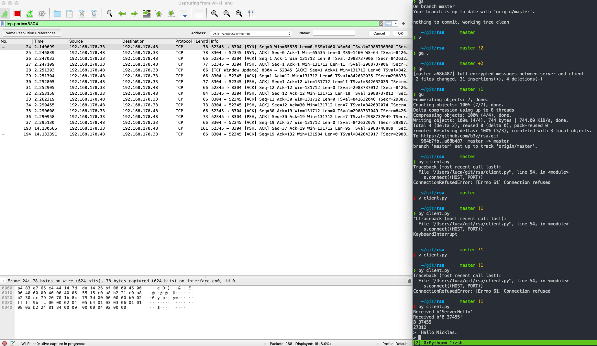
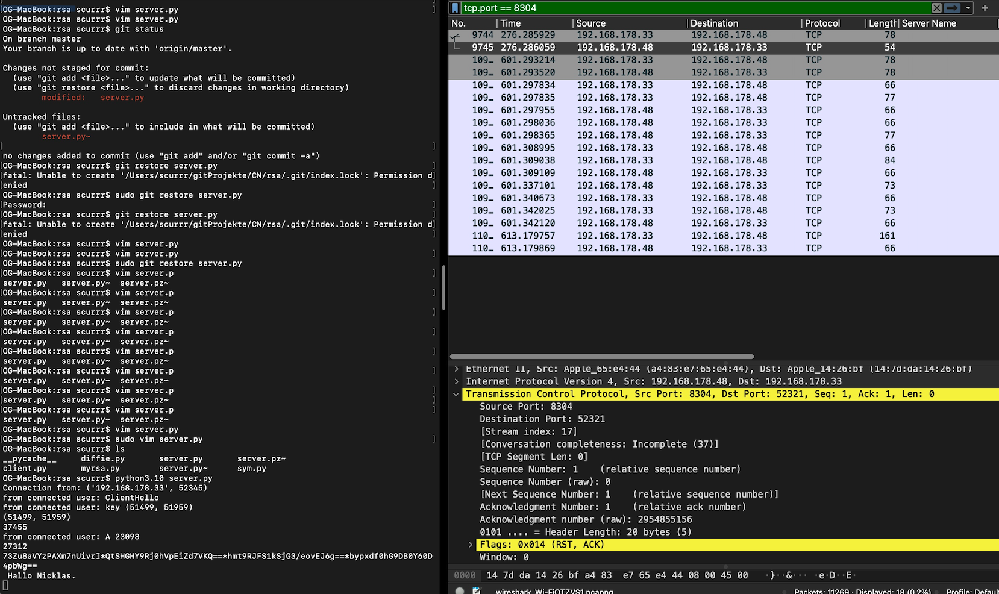
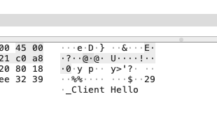
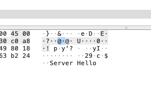
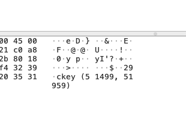
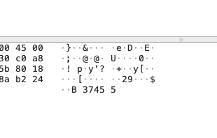
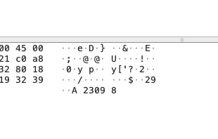
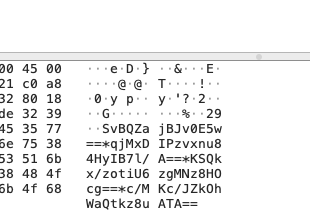

# Client Sicht
Der Client sendet eine Nachricht an den Server nach dem Handshake.
Diese ist verschlüsselt und wird mittels des shared Secrets nach dem Diffie Hellmann Key Exchange vom Server entschlüsselt.

# Server Sicht 

Das sind hier bei verschiedene Maschinen im selben Netzwerk

# Ablauf eines Handshakes und das Senden und einer verschlüsselten Nachricht

Client Hello

Server Hello

Austausch des client Public Keys

Austausch Zwischenergebnisse

Senden einer verschlüsselten Nachricht

